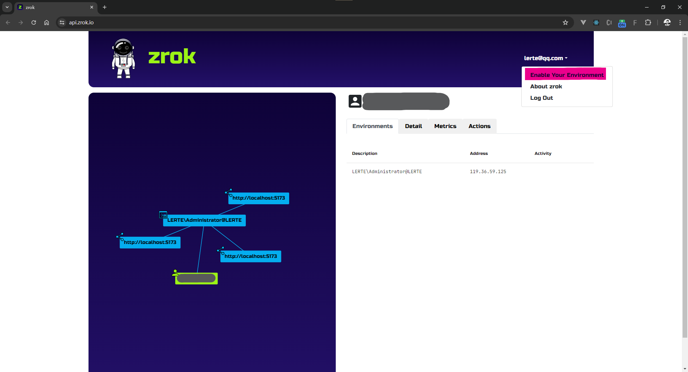
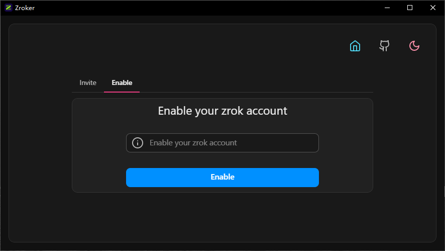

### Copy your Enable Your Environment from zrok dashboard.

### Paste the code to this app, then click **Enalbe** button.

### After enabled successfully, you will see the [overview](/docs/overview)
